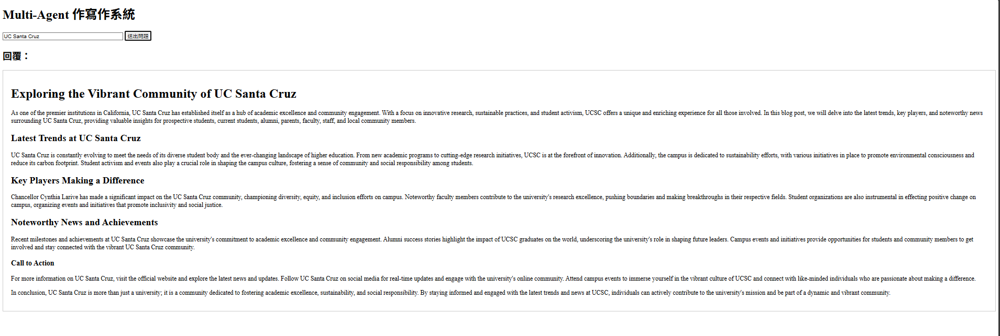

# 📚 Multi-Agent 協作寫作系統

本專案以 **Multi-Agent 系統** 實作，模擬三位 AI 角色（Planner、Writer、Editor）分工協作完成一篇文章。  
最終結果會即時顯示在網頁前端，並以 **Markdown** 格式渲染展示。

---

## 🔥 專案架構

- **Planner (內容規劃者)**：  
  - 負責收集主題資料，擬定文章大綱、目標受眾、SEO關鍵字。
- **Writer (內容撰寫者)**：  
  - 根據 Planner 的大綱撰寫文章，結構清晰，符合品牌風格。
- **Editor (內容編輯者)**：  
  - 校對文章語法與文風，確保文章符合出版標準並避免爭議性內容。

三位 Agent 使用 [**CrewAI**](https://docs.crewai.com/) 架構合作，依序完成任務，並輸出最終的 Markdown 文章。

---

## 📦 專案檔案說明

| 檔案             | 說明                          |
|------------------|-------------------------------|
| `index.html`     | 前端頁面，提供輸入與文章展示功能。使用 `marked.js` 進行 Markdown 渲染。 |
| `app.py`         | Flask 服務器，串接前端與 Multi-Agent 後端。 |
| `run_multi_agent.py` | 定義三個 Agent、任務（Task），並整合成一個完整的 Crew 流程。 |

---

## 🚀 如何執行

### 1. 安裝必要套件

```bash
pip install flask flask-cors crewai
```

(請確保你也有設定好 OpenAI API Key)

### 2. 啟動後端服務器

```bash
python app.py
```

後端會在 `http://localhost:5000` 啟動。

### 3. 開啟前端頁面

直接用瀏覽器打開 `index.html`。  
輸入主題（例如："Artificial Intelligence"），即可啟動多代理人寫作流程。

---

## 🛠 系統流程圖

```
[使用者輸入主題] 
       ↓
[Flask 接收並觸發 run_multi_agent]
       ↓
[Planner 規劃內容 → Writer 撰寫 → Editor 校對]
       ↓
[最終 Markdown 文章]
       ↓
[前端頁面顯示結果]
```

---

## 💡 技術亮點

- 多代理人 (Multi-Agent) 分工合作流程
- Markdown 內容即時渲染
- 後端使用 Flask + CrewAI 架構
- 支援跨域請求 (CORS)
- 模組化設計，方便擴充更多角色或任務


---

## 📷 專案截圖

```markdown

```


